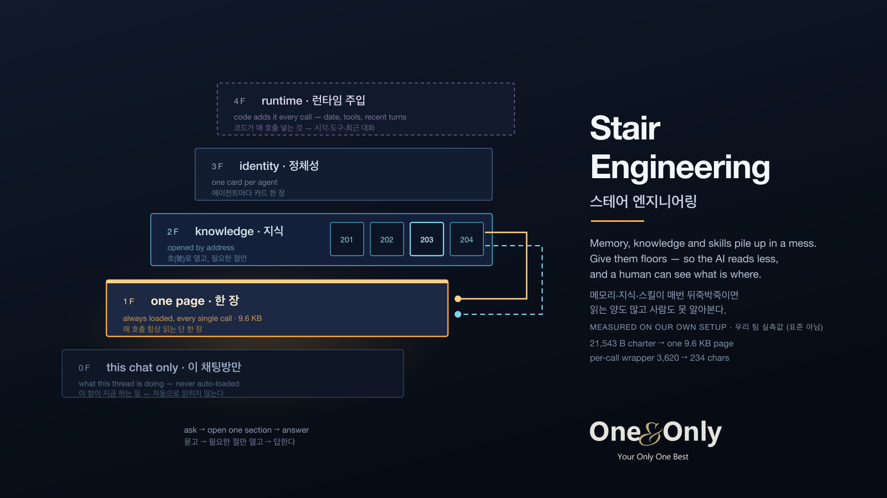

# Stair Engineering

**What you always read must be thin. Deep knowledge lives up the stairs.**



Stair Engineering is a small, tool-agnostic way to organize what an AI agent (or a team of them) reads on every call. It came out of running a 15-agent team where the shared "charter" had grown to 21.5 KB and was injected on every single message — long enough that some tools started truncating it and agents quietly lost rules.

The fix was not a bigger context window. It was a staircase.

```
Layer 4   runtime       what your code injects on every call — today's date, the tool list,
                        recent turns. Not in any file, easy to forget you are paying for it.
Layer 3   identity      one card per role — who it is, how it speaks. Optional.
                        Solo users: one card per *mode* (build / review / write), swapped per task.
Layer 2   knowledge     rooms by address (201, 202, 203…) — opened only when needed, one section at a time
Layer 1   memory        ONE page — always loaded, every single call
Layer 0   this chat      what THIS thread is working on — one file per chat, never auto-loaded
```

Layer 4 is the one people miss. You trim your prompt file and the context is still huge, because the harness is
quietly adding a date line, a tool schema and three turns of history every call. Count it, or it eats the savings.

Layer 0 is the one people need but rarely write down. You keep more than one chat open with your agent —
one refactoring auth, one writing docs, one chasing a bug. Each thread has its own state: what was decided,
what was ruled out, where it stopped. That state cannot go in Layer 1, because every other chat would then
read it on every call; and it is not knowledge, because it expires the day the task ships. So each chat gets
a file that only it ever sees, and when the context window resets you hand the thread back its own file.
Anything in there that outlives the task gets promoted upstairs — a fact to a room, a rule to Layer 1.

Everything above Layer 1 is reachable by *address* ("Room 201, section Indexing"), never by scrolling.

## The whole staircase in 55 seconds

[](https://youtu.be/52ZHKbmZXEw)

The page that grows until lines fall off the end · rooms opened by number, one section at a time ·
the note that belongs to one chat and no other · the checker that finds a room nothing points to.
Korean narration, Korean + English subtitles. A vertical cut is at [youtu.be/JA4eQtFKzkw](https://youtu.be/JA4eQtFKzkw).

## Who this is for

**One person with one coding agent** first — Claude Code, Codex, Cursor, Gemini CLI, Ollama, LM Studio. Teams of agents work too, but the spec is written for the single-agent case. Both the AI and the human. Especially people who build with AI without a developer background ("vibe coding"): you should be able to **see** what your agent always reads (one page), **find** where a piece of knowledge lives (a room number), and **change** it without touching code (edit a markdown file, run one command). If a page is too long to read in a minute, it is too long for the agent too.

## Why this is different from "just use RAG"

- **Addresses, not similarity.** Knowledge is found by a human-readable room number and section title. An agent can *say* where something is ("that's in 201, under Ranking"), and a human can check it in five seconds.
- **The one-page rule is enforced by tools, not by discipline.** `stair_toc.py check` tells you when a room has no route to it (nobody can find it), when a route points at nothing, and how big Layer 1 has grown.
- **Section-level loading.** A 25 KB room costs as much as ten Layer 1 pages if you open it whole. Every room carries a generated table of contents; the loader hands out the TOC first and a single section on request.
- **Works for agents that cannot read files.** The loader prints plain text you can paste anywhere — a system prompt, a `CLAUDE.md`, an `AGENTS.md`, `.cursorrules`, an Ollama Modelfile.

## Measured, not promised

**These are our own numbers, not a standard.** They come from one team's setup measured before and after on the same tasks in a single day. Nothing here promises you the same ratio — the point is that you can measure yours the same way, and the tool prints the size for you.

| what | before | after |
|---|---|---|
| always-injected text per call | 21,543 B charter | 9.6–11 KB Layer 1 (rules moved out of the wrapper into the page, wrapper cut from 3,620 to 234 chars) |
| per-call prompt for our leanest agent (no file system, everything inline) | ~2,900 chars of boilerplate | 1,111 chars (−62 %) |
| rules damaged in transit | happened (charter truncated) | happened once more the same day (a mention-token cleaner blanked two Layer 1 lines) — caught by the reviewer agent within the hour, root-caused, fixed. The staircase made it *visible*; it did not make it impossible |
| files nobody could find ("unrouted") | unknown | 0, checked by tool |
| hosts out of sync (knowledge copies) | 10 of 24 files on one host | 24/24 on all hosts, auto-synced, verified by count |

These are numbers from **our** production team's day, not from this repository — the example Layer 1 here is ~2.5 KB and `stair_toc.py check` will print exactly that. Your numbers will differ; the tool prints Layer 1's byte size on every `check` so you can watch it.

About size: our Layer 1 runs 9–11 KB because it carries rules for 15 agents on 3 machines. A single-agent, single-machine setup should be far smaller — for local models aim under ~3 KB.

## Quick start (60 seconds)

Most people do not want a new repo — they want stairs *inside their own project* (or use this repo as a template / download the ZIP):

```bash
git clone https://github.com/OnenOnlyLabs/stair-engineering /tmp/stairs
cp -r /tmp/stairs/stairs /tmp/stairs/tools ~/your-project/     # the stairs and the two tools, nothing else
cd ~/your-project
# Windows (PowerShell):  Copy-Item -Recurse C:\tmp\stairs\stairs,C:\tmp\stairs\tools C:\your-project\ ; cd C:\your-project
python3 tools/stair_load.py                          # Layer 1 — paste this into your system prompt
python3 tools/stair_load.py --agent researcher       # + an identity card
python3 tools/stair_load.py --route "check ranking"  # + the right room's TOC, picked by keywords
python3 tools/stair_load.py --room 201 --section indexing   # + exactly one section
python3 tools/stair_toc.py check                     # is the staircase honest?
python3 tools/build_viewer.py                        # → stairs.html, double-click it
```

Python 3.8+. No dependencies. No network.

**Windows:** use `python` instead of `python3`, and write files with `--out FILE` instead of `>` — PowerShell's `>` saves UTF-16 and the next tool that reads the file as UTF-8 will crash. Windows example scripts are in `examples/*.ps1` and `examples/*.bat`.

Then make the stairs yours: [`docs/creating-your-memory.md`](docs/creating-your-memory.md) (your Layer 1) and [`docs/adding-a-room.md`](docs/adding-a-room.md) (a new Layer 2 room in three steps).

## Use it with your tool

- **Claude Code** — `python3 tools/stair_load.py --agent builder --out CLAUDE.md`. Rooms on demand: tell Claude to run the loader with `--room`.
- **Codex CLI / OpenAI agents** — same, `--out AGENTS.md`.
- **Cursor / VS Code agents** — into `.cursorrules` or your rules file.
- **Gemini CLI / Antigravity** — into the project context file your tool reads.
- **Ollama / LM Studio / raw API** — put the loader output in the `system` message. For local models Layer 1 size matters even more; keep it under ~3 KB.
- **Any chat UI without a file system** — paste Layer 1 once as custom instructions; paste a room's section when the task needs it.

See [`docs/using-with-tools.md`](docs/using-with-tools.md) for copy-paste snippets.

## See it, don't just run it

`python3 tools/build_viewer.py` writes **one self-contained `stairs.html`** — no server, no build, no network.
Double-click it and you get your floors, the files on each floor, and the sections inside each file, in the same
order the loader hands them to the agent. This is the half that terminals do not give you: a person who does not
write code can look at the page and say "that rule is in the wrong place" — which is the whole point.

Re-run the builder after you edit `stairs/`. The HTML embeds a copy of your text, so treat it like any other
generated artifact (it is gitignored by default).

### About Layer 3 if you work alone

You still switch hats — writing code, reviewing it, writing docs — and each hat wants a different attitude.
Most people re-type that attitude into the prompt every time, or bolt it onto the always-loaded page and make it fat.
A card per mode fixes both: `--agent review` attaches the attitude for that task only, and Layer 1 stays thin.

Layer 3 is optional. If you only ever work one way, put those two lines in Layer 1 and skip this floor —
a staircase with an empty floor is worse than a shorter staircase.

## The rules that make it work

1. **Layer 1 is one page.** If it grows, move rules into a room and leave one line pointing there. The tool prints the size so you notice.
2. **Nothing lives outside the address book.** A room without a route in Layer 1 (or `routes.txt`) does not exist. `check` catches it.
3. **Every room has a TOC.** Generated, idempotent (`stair_toc.py toc --apply`). Read the TOC first, then one section.
4. **Change the wiring → write one line in Room 204.** The system's own history lives in the system, not in chat.
5. **Layer 0 never leaks upward.** One chat's notes are loaded by that chat only (`--chat <name>`), and are deleted when the work ships. What survives gets promoted to a room or to Layer 1 first. `check` warns when a chat note passes 8 KB, which almost always means something in it should have moved.
6. **One canonical copy.** If you run agents on several machines, one machine owns the stairs and pushes copies. Verify by count after each push. (We learned this the hard way — see Known limits.)

## Known limits (please read before you clone this into production)

- **Layer 1 will try to grow.** Every incident adds "one more line". Set a soft budget and audit it; the tool only *shows* the size, it does not stop you.
- **Copies drift.** Files arriving on a machine is not the same as an agent process having loaded them. Restart after deploy, and check the process start time against the file's mtime. Our first day: 14 of 24 knowledge files were missing on one host and nothing complained until an agent answered from an empty room.
- **Section matching is by title substring.** Name your sections the way people ask for them.
- **Routing is keyword-based on purpose** (transparent, debuggable). It will miss paraphrases. Agents can always ask for the room list.
- **Never put secrets in Layer 1.** It is injected everywhere and pasted into every tool. Keys, tokens, customer names, private hostnames — none of it belongs on the stairs. Reference a vault, don't copy from it.
- **After you push files, restart the agent process — as a command, not a hope.** `pkill -f your_agent && start it again`, then compare the process start time to the file's mtime. If start < mtime, the agent is still running old memory. Our first day: files were on the host, the process was 2.5 hours older, and nobody noticed until an agent answered from a stale page.
- **This does not replace retrieval for large corpora.** It is for the operating knowledge of a team — tens of files, not tens of thousands.

## Repository layout

```
stairs/layer0/*.md          per-chat notes (never auto-loaded; example + the rules)
stairs/layer1/MEMORY.md     Layer 1 (example team — replace with yours)
stairs/layer2/*.md          rooms (examples)
stairs/layer3/*.md          identity cards (examples)
stairs/routes.txt           keyword routing table
tools/stair_load.py         the loader — prints what to inject
tools/stair_toc.py          TOC generator + staircase checker
tools/build_viewer.py       writes a single self-contained stairs.html you can double-click
docs/                       how to use with specific tools, design notes
```

## Origin

Built by [One&Only](https://onenonly.ai.kr) for its internal multi-agent team ("AI Black Board"), August 2026, after a truncation incident made it obvious that the always-loaded page had to become thin. The team's own stairs, agents, and knowledge are not included — only the shape and the tools.

## License

MIT — see `LICENSE`.
